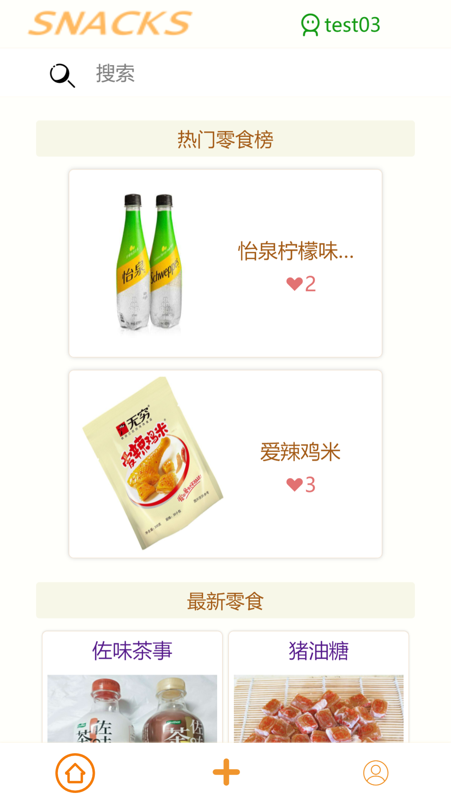
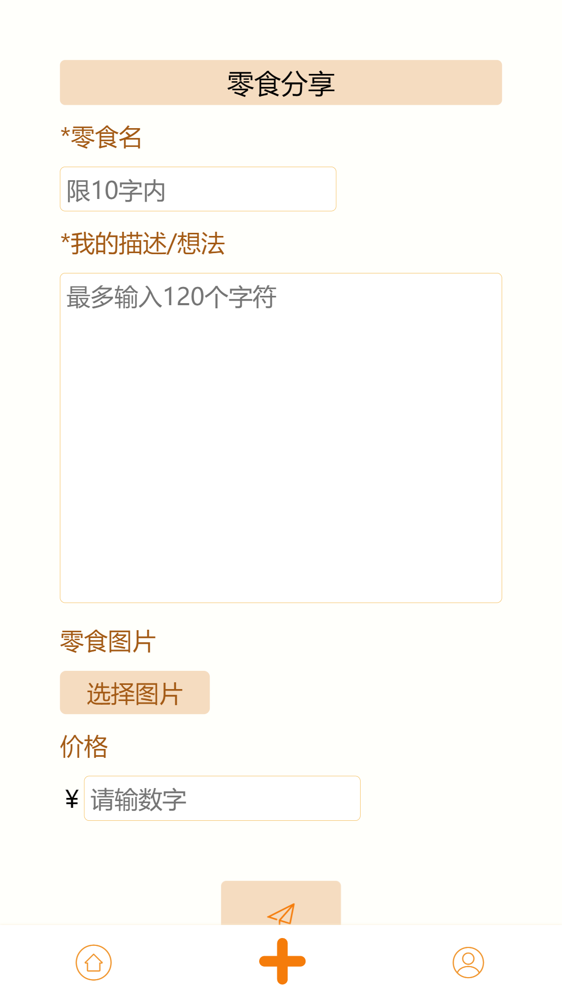
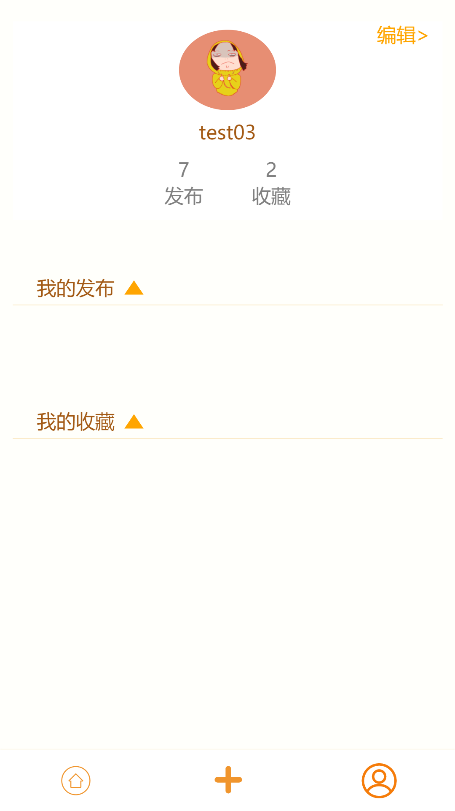
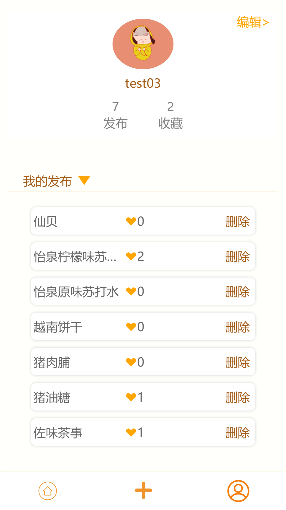
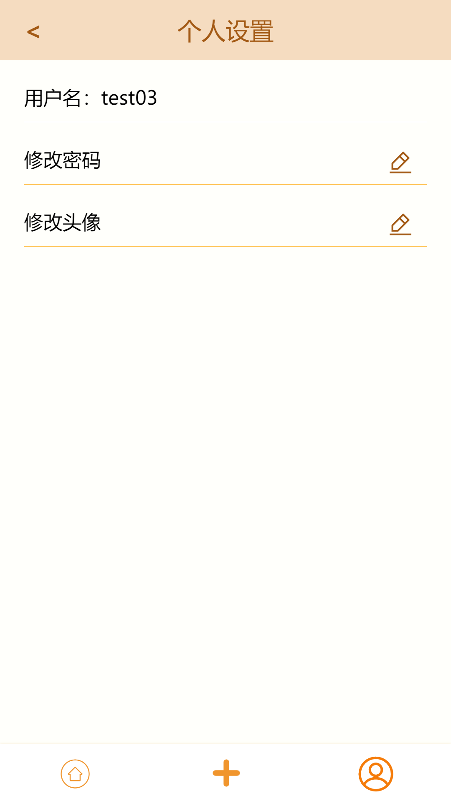
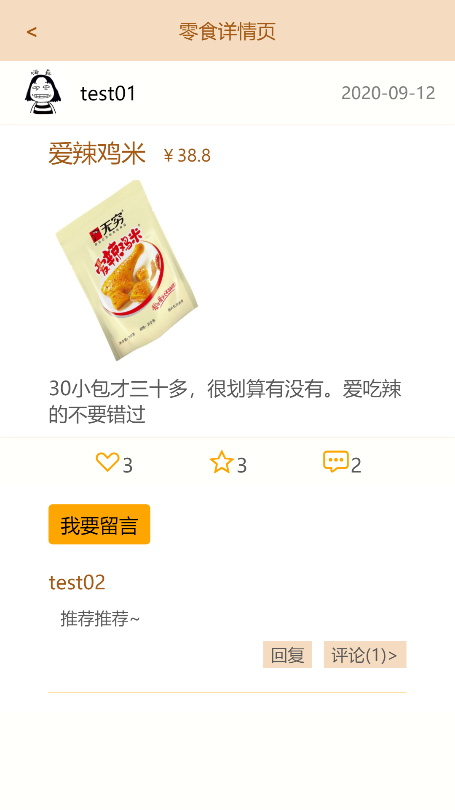
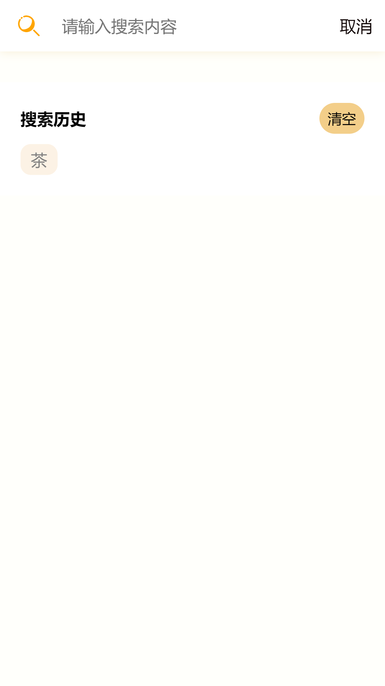

# snack-app

## 项目简介
一个可以和大家分享自己喜欢的零食的移动端项目，涉及的技术栈主要有Vue + Sass + Koa + Mongoose + MongoDB。

项目主要功能有：登录/注册、搜索零食、发布零食、留言/评论、收藏零食/点赞零食、显示热门零食、修改个人信息。

如有错误之处，欢迎指正~

## 运行
首先要连接到数据库：

[Snack-server](https://github.com/6fa/Snack-Server)

回到snack-app，安装依赖
```
npm install
```

使用vue cli的热更新功能开启服务：
```
npm run serve
```

如果运行成功，终端可以看到如下信息：
```
  App running at:
  - Local:   http://localhost:8080/
  - Network: http://xxx:8080/
```
使用上面的链接即可访问查看效果

如果想打包代码，则终端输入：
```
npm run build
```

## 部分效果图
#### 首页图


#### 分享页


#### 个人页面




#### 编辑页面


#### 零食详情页


#### 搜索页


